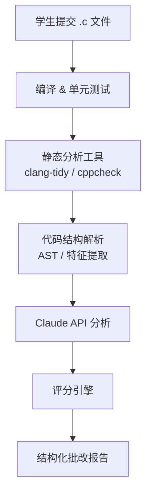
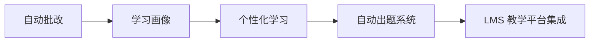

# 🧠 基于 Claude API 的 C 语言作业自动批改与反馈 Agent

## 📌 项目简介

本系统是一个面向编程教学场景的自动化作业批改 Agent，基于 Claude API 构建，旨在解决传统教学中：

* 助教人力不足
* 作业反馈周期长
* 批改标准不统一

等核心问题。

系统通过“静态分析 + 大语言模型”结合的方式，实现对 C 语言作业的自动评估与高质量反馈生成。

---

## 🚀 核心成果

| 指标     | 优化前   | 优化后            | 提升效果   |
| ------ | ----- | -------------- | ------ |
| 平均反馈时间 | 2 小时  | **5 分钟**       | ⬇️ 96% |
| 日处理作业量 | ~15 份 | **60 份**       | ⬆️ 4 倍 |
| 助教参与度  | 高依赖   | **低依赖**        | 自动化    |
| 反馈质量   | 不稳定   | **结构化 + 可读性强** | 显著提升   |

---

## 🏗️ 系统架构



---

## ⚙️ 核心流程说明

### 1️⃣ 编译与测试阶段

* 自动检测：

  * 编译错误（syntax error）
  * 基础逻辑正确性（测试用例）

---

### 2️⃣ 静态分析阶段

使用工具：

* `clang-tidy`
* `cppcheck`

检测内容：

* 未初始化变量
* 内存泄漏
* 指针错误
* 潜在未定义行为

---

### 3️⃣ 结构化信息提取

系统将代码转换为结构化数据：

```json
{
  "compile": "pass",
  "warnings": ["unused variable"],
  "functions": ["main", "sort"],
  "pointer_usage": true,
  "memory_risks": ["possible leak"]
}
```

👉 作用：

* 降低 LLM 成本
* 提高分析稳定性

---

### 4️⃣ Claude 智能分析

Claude 负责：

* 代码风格分析
* 逻辑漏洞识别
* 可读性评估
* 改进建议生成

---

### 5️⃣ 评分与报告生成

采用“规则 + AI”双轨评分机制：

| 维度   | 评分方式       | 权重  |
| ---- | ---------- | --- |
| 正确性  | 单元测试       | 40% |
| 内存安全 | 静态分析       | 20% |
| 代码规范 | 静态分析 + LLM | 20% |
| 可读性  | LLM        | 20% |

---

## 📄 批改报告示例

```json
{
  "score": 78,
  "breakdown": {
    "correctness": -10,
    "style": -5,
    "memory": -7
  },
  "issues": [
    {
      "type": "memory_leak",
      "line": 42,
      "severity": "high",
      "suggestion": "free allocated pointer"
    }
  ],
  "suggestions": [
    "使用更具描述性的变量名",
    "避免重复代码，提取函数"
  ]
}
```

---

## 🎯 系统亮点

### ✅ 高效率

* 批改时间从 **2 小时 → 5 分钟**

### ✅ 高一致性

* 统一评分标准，避免人为波动

### ✅ 高可扩展性

* 支持批量作业处理
* 可扩展到其他语言（C++ / Python）

---

## 📊 教学价值延伸

### 📈 学习画像（Learning Analytics）

系统可统计：

* 学生常见错误类型
* 编程能力变化趋势
* 个性化弱点分析

---

### 🧩 自动出题（未来方向）

基于学生弱点生成练习：

```text
检测到问题：
- 指针错误频繁
- 内存释放缺失

→ 自动生成链表相关练习题
```

---

### 👨‍🏫 助教增强（TA Copilot）

提供：

* 作业错误 Top10 分析
* 班级整体表现报告
* 异常提交检测（疑似抄袭）

---

## ⚠️ 风险与挑战

| 问题     | 风险      | 解决方案          |
| ------ | ------- | ------------- |
| LLM 幻觉 | 错误分析    | 关键检测依赖静态工具    |
| 评分波动   | 不公平     | 固定参数 + 标准数据校准 |
| 成本问题   | 大规模课程压力 | 代码裁剪 + 缓存机制   |

---

## 🧭 未来发展路线



---

## 🧩 总结

该系统不仅是一个自动批改工具，更是：

> 🎓 **AI 驱动的编程教学基础设施雏形**

通过结合静态分析与大语言模型，实现：

* 高效批改
* 精准反馈
* 可持续教学优化

具备向教育平台级系统演进的潜力。

---

